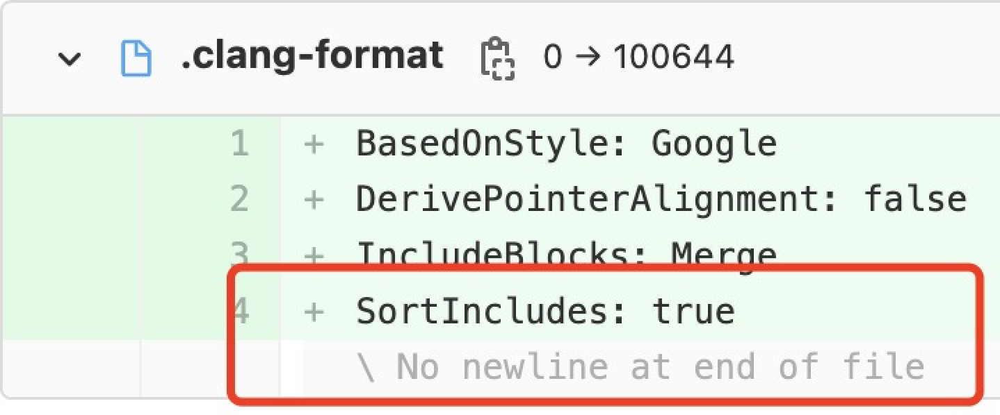

<!-- markdownlint-disable -->
<head>
    <script src="https://cdn.mathjax.org/mathjax/latest/MathJax.js?config=TeX-AMS-MML_HTMLorMML" type="text/javascript"></script>
    <script type="text/x-mathjax-config">
        MathJax.Hub.Config({
            tex2jax: {
            skipTags: ['script', 'noscript', 'style', 'textarea', 'pre'],
            inlineMath: [['$','$']]
            }
        });
    </script>
</head>
<!-- markdownlint-restore -->

# Code Review 漫谈

本文档遵守：

- [中文文案排版指北](https://github.com/sparanoid/chinese-copywriting-guidelines)
- [文案风格指南](https://open.leancloud.cn/copywriting-style-guide/)

本文档记录 code review 过程中值得记录的点点滴滴和思考。

本文档和 [谷歌代码审核指南](https://jimmysong.io/eng-practices/docs/review) 穿插阅读效果更佳。

## 目录

- [Code Review 漫谈](#code-review-漫谈)
  - [目录](#目录)
  - [【通用】一次 code review 的工作量](#通用一次-code-review-的工作量)
  - [【通用】部分代码要求低](#通用部分代码要求低)
  - [【通用】commit history](#通用commit-history)
  - [【通用】有意义的 diff](#通用有意义的-diff)
  - [【通用】TODO 注释](#通用todo-注释)
  - [【通用】专有名词](#通用专有名词)
  - [【通用】将循环体内的“不变量”移到循环体外](#通用将循环体内的不变量移到循环体外)
  - [【通用】重复代码片段](#通用重复代码片段)
  - [【通用】文件末尾换行](#通用文件末尾换行)
  - [【通用】端口案例](#通用端口案例)
  - [【通用】获取私有 IPv4 地址案例](#通用获取私有-ipv4-地址案例)
  - [【算法】随机算法案例](#算法随机算法案例)
  - [【一致性】不一致案例](#一致性不一致案例)
  - [【可读性】缩写](#可读性缩写)
  - [【可读性】时间命名案例](#可读性时间命名案例)
  - [【可读性】日志案例 1](#可读性日志案例-1)
  - [【可读性】日志案例 2](#可读性日志案例-2)
  - [【可读性】日志案例 3](#可读性日志案例-3)
  - [【可读性】函数注释案例 1](#可读性函数注释案例-1)
  - [【可读性】函数注释案例 2](#可读性函数注释案例-2)
  - [【可读性】函数注释案例 3](#可读性函数注释案例-3)
  - [【可读性】函数命名案例 1](#可读性函数命名案例-1)
  - [【可读性】函数命名案例 2](#可读性函数命名案例-2)
  - [【扩展性 & 可读性】函数设计案例 1](#扩展性--可读性函数设计案例-1)
  - [【扩展性 & 可读性】函数设计案例 2](#扩展性--可读性函数设计案例-2)
  - [【扩展性 & 可读性】分支优化案例 1](#扩展性--可读性分支优化案例-1)

## 【通用】一次 code review 的工作量

过多改动是阻碍有效、快速 review 的最大敌人。

我遇到的“大型 code review”通常有两种我们都不希望看到的结果：

- 拖很久完成 code review，但是 reviewer 受不了持久战而做出妥协。
- 拖很久不了了之，没有完成 code review 而直接提交。

**最佳实践：**

- **一次 code review 的改动控制在 200 行以内，不超过 1000 行。**
- **一次 code review 的 commit 控制在 5 个以内，不超过 10 个。**
- **一次 code review 不包含不相关的 commit。**

## 【通用】部分代码要求低

> **案例 1**
>
> “这是测试，这么写省事儿，没必要关注安全问题吧。”
>
> **案例 2**
>
> “这是测试，这段代码不需要写注释了吧。”
>
> **案例 3**
>
> “这是例子，不需要考虑性能和安全性了吧。”
>
> **案例 4**
>
> “这是离线代码，性能差一点无所谓。”

我经常遇到一种情况是：降低对测试、例子、离线代码的要求。

这会造成以下不良影响：

- 代码会在开发者中传播、传承，糟糕的代码会增加各个环节的成本。
- 例子中的代码片段会在使用者中传播，错误和劣化的代码也会像病毒一样传播。
- 离线任务变慢，资源消耗变多。

**最佳实践：**

- **请用高标准、严要求写所有代码。**

## 【通用】commit history

本小节以 git 为例。

> **案例 1**
>
> 某同事的所有 commit message 都是“update”。
>
> reviewer 不关注 commit message。
>
> **案例 2**
>
> 某同事发起 code review，针对 reviewer 的问题，每改动一次就创建一个带有相同 message 的 commit。
>
> **案例 3**
>
> 某项目的开发模式是“创建分支 - 在分支开发 - 合并到 master”。
>
> 该项目成员从不 rebase master，开发完成后用“merge”的方式合并到 master。

问题：

- 案例 1：commit history 中存在大量连续的“update”commit。
- 案例 2：commit history 中存在大量连续的有相同 message 的 commit。
- 案例 3：commit history 中存在大量分叉和 merge commit。

**最佳实践：**

- **请培养意识：commit history 和代码同等重要，commit history 也是给人看的，commit history 有时候还需要回溯。**
- **请用高标准、严要求写 commit message。**
- **请维护好 commit tree：**
  - **保持 commit tree 是线性的。**
  - **用“rebase and merge”或“squash and merge”合并分支。**

## 【通用】有意义的 diff

无意义的 diff 是阻碍有效、快速 review 的另一大敌人。

什么是无意义的 diff 呢？

> **案例 1**
>
> 某项目代码格式不统一，某天项目负责人决定统一格式风格，要求项目成员配置代码格式化工具。
>
> 某同事修改了几十行代码，保存时代码格式化工具对代码格式化，产生上百行 diff。
>
>**案例 2**
>
> 某项目将 ```.proto``` 文件和生成的 ```.pb.cc``` 和 ```.pb.h``` 文件提交到代码库。
>
> 某同事给该 ```.proto``` 文件添加一个字段，产生几十行 diff。
>
>**案例 3**
>
> 某项目将二进制测试数据提交到代码库。
>
> 某同事更新二进制测试数据。
>
>**案例 4**
>
> 某同事重构了某模块，重构前后的代码差异巨大。

问题：

- 案例 1 & 2：少量有意义 diff 藏于大量无意义 diff 中。
- 案例 3：二进制文件不适合 diff。
- 案例 4：diff 无意义。

有意义的 diff 就是 diffable（suitable for processing by a diff program in order to show differences）的 diff。

可以这样改进：

- 案例 1：从工具层面保持项目统一的格式风格。如果要修改格式风格，统一修改并直接提交。
- 案例 2：不提交生成的 protobuf 代码。
- 案例 3：提交生成“二进制测试数据”的代码，而不是“二进制测试数据”本身。
- 案例 4：不关注 diff，review 重构后的代码。

## 【通用】TODO 注释

“对那些临时的，短期的解决方案，或已经够好但仍不完美的代码使用 TODO 注释。”

每个 TODO 注释都是一个“坑”。我们允许“坑”的存在，但不允许“暗坑”的存在。

要注意的是，TODO 注释的格式是：

```c++
// TODO(who) to do what.
// TODO(who): when to do what.
```

TODO 注释一定要带上挖“坑”人，还可以带上填“坑”时间，让 TODO 不会变成 NEVERDO。

## 【通用】专有名词

任何项目的业务领域和技术领域中，都存在大量专有名词。

Doc work（文档、issue、代码注释等）要特别注意专有名词。

**最佳实践：**

- **专有名词有官方写法的，请在 doc work 中使用官方写法。**
- **专有名词没有统一写法的，请在 doc work 中使用更流行的写法。**
- **以上只针对 doc work。**

一些专有名词正确和错误的写法：

| 正确 | 错误 |
| :- | :- |
| CentOS | centos |
| deepx | DeepX |
| GitHub | github、Github |
| GitLab | gitlab、Gitlab |
| HDFS | hdfs、Hdfs |
| iOS | ios |
| LZ4 | lz4、Lz4 |
| macOS | macos、MacOS |
| Redis | redis |
| Snappy | snappy |
| TensorFlow | tensorflow、Tensorflow |
| Visual Studio Code | visual studio code |
| Xcode | xcode、XCode |

## 【通用】将循环体内的“不变量”移到循环体外

如题。

## 【通用】重复代码片段

消除重复代码片段。

考虑用代码生成大致雷同的代码。

## 【通用】文件末尾换行

在 code review 时，经常可以看到类似下图的“No newline at end of file”。

<!-- markdownlint-disable -->

<!-- markdownlint-restore -->

对于所有文本文件，在末尾添加且仅添加一个换行。

[Why should text files end with a newline?](https://stackoverflow.com/questions/729692/why-should-text-files-end-with-a-newline)

## 【通用】端口案例

某服务启动时，这样暴露”端口“参数：

```c++
// 反例：
class ServerConfig {
 public:
  // ...
  uint16_t GetPort() const;
  // ...
};
```

这个参数可能是这个服务的监听端口吧。

问题：

- 如果这个服务要监听多个端口，则 `GetPort` 没有区分度，需要改名。
- 只有端口，没有协议和地址，会引起歧义：
  - 协议是 IPv4 还是 IPv6，是 TCP 还是 UDP，是 HTTP 还是 FTP。
  - 地址是某个设备的地址，还是 `0.0.0.0`，还是 `::`。

**最佳实践：**

- **监听地址要给出协议、地址、端口三要素。**
  - **当上下文只有一种协议时，可以省略协议。**

## 【通用】获取私有 IPv4 地址案例

某服务的启动脚本这样获取自己的 IPv4 地址：

```shell
# 反例：
ifconfig -a |
    grep inet |
    grep -i cast |
    grep -v inet6 |
    awk '{print $2}' |
    tr -d "addr:"
```

问题：

- 管道太多：
  - 可读性差。
  - 可维护性差。
  - 性能差。
- `-a` 会显示被禁用的设备，比如被 `ifdown` 的设备。
- 没有排除 lo 设备和 docker 虚拟设备。
- `grep -i cast` 多余。
- `grep inet` 和 `grep -v inet6` 最好紧挨着。
- `grep inet` 和 `grep -v inet6` 可以用 `grep "inet "` 代替。

可以这样改进：

```shell
ifconfig |
    awk '/^.*: flags=/{interface=$1}
         /inet / && interface !~ "^lo" && interface !~ "^docker" {sub("addr:", "", $2); print $2; exit 0;}'
```

**最佳实践：**

- **注释复杂输入的格式。**
- **注释复杂管道命令的用途。**
- **用更强大的工具减少管道数：**
  - **`awk`**
  - **`sed`**

## 【算法】随机算法案例

随机从数组 x 中选出 n 个数字，选出数字的顺序不同算不同的结果。

令 m 为数组 x 的大小，理想情况下，这个随机算法要求：

- 当 $m \gt n$ 时，有 $\frac{m!}{(m-n)!}$ 种结果，每种结果的概率是 $\frac{(m-n)!}{m!}$。
- 当 $m \le n$ 时，有 $m!$ 种结果，每种结果的概率是 $\frac{1}{m!}$。

```c++
// 反例：
// 伪码
定义数组 y;
if (x.empty()) {
  return y;
}
int m = x.size();
int j = random_uniform_int(0, m - 1);
for (int i = j; i < m; ++i) {
  if (y.size() == n) {
    break;
  }
  y.add(x[i]);
}
for (int i = j; i >= 0; --i) {
  if (y.size() == n) {
    break;
  }
  y.add(x[i]);
}
return y;
```

问题：

- 达不到理想情况。

可以这样改进：

```c++
// 伪码
// Fisher-Yates 洗牌算法。
int m = x.size();
if (m > n) {
  m = n;
}
for (int i = 0; i < m - 1; ++i) {
  int j = random_uniform_int(i, m - 1);
  if (i != j) {
    交换 x[i] 和 x[j];
  }
}
return x[0:n];
```

分析：

<!-- markdownlint-disable -->
- 当 $m \gt n$ 时：
  - $x_0$ 在位置 0 的概率是 $\frac{1}{m}$。
  - $x_0$ 在位置 0，$x_1$ 在位置 1 的概率是 $\frac{1}{m} * \frac{1}{m-1}$。
  - $x_0$ 在位置 0，$x_1$ 在位置 1，$x_2$ 在位置 2 的概率是 $\frac{1}{m} * \frac{1}{m-1} * \frac{1}{m-2}$。
  - ...
  - $x_0$ 在位置 0，$x_1$ 在位置 1，...，$x_{n-2}$ 在位置 n-2 的概率是 $\frac{1}{m} * \frac{1}{m-1} * \frac{1}{m-2} * \cdots * \frac{1}{m-n+2}$。
  - $x_0$ 在位置 0，$x_1$ 在位置 1，...，$x_{n-1}$ 在位置 n-1 的概率是 $\frac{1}{m} * \frac{1}{m-1} * \frac{1}{m-2} * \cdots * \frac{1}{m-n+2} * \frac{1}{m-n+1} = \frac{(m-n)!}{m!}$。
  - 因为分析过程中 $x_i$ 不失一般性，所以任意序列的概率是 $\frac{(m-n)!}{m!}$。
- 当 $m \le n$ 时：
  - $x_0$ 在位置 0 的概率是 $\frac{1}{m}$。
  - $x_0$ 在位置 0，$x_1$ 在位置 1 的概率是 $\frac{1}{m} * \frac{1}{m-1}$。
  - $x_0$ 在位置 0，$x_1$ 在位置 1，$x_2$ 在位置 2 的概率是 $\frac{1}{m} * \frac{1}{m-1} * \frac{1}{m-2}$。
  - ...
  - $x_0$ 在位置 0，$x_1$ 在位置 1，...，$x_{m-2}$ 在位置 m-2 的概率是 $\frac{1}{m} * \frac{1}{m-1} * \frac{1}{m-2} * \cdots * \frac{1}{2}$。
  - $x_0$ 在位置 0，$x_1$ 在位置 1，...，$x_{m-1}$ 在位置 m-1 的概率是 $\frac{1}{m!}$。
  - 因为分析过程中 $x_i$ 不失一般性，所以任意序列的概率是 $\frac{1}{m!}$。
<!-- markdownlint-restore -->

**最佳实践：**

- **理论分析，保证理论分布符合预期。**
- **测试，保证统计分布和理论分布近似。**
- **简单、高效。**
- **无状态、可重入、无锁。**

## 【一致性】不一致案例

好的**一致性**和**可读性**是优秀代码最重要的两个要素，是 code review 的重点关注对象。

下面将列举不一致的案例，欢迎对号入座。

> **案例 1**
>
> 全角标点 vs 半角标点
>
> ```\n``` 换行符 vs ```\r\n``` 换行符
>
> UTF-8 编码 vs GBK 编码
>
> 2 空格缩进 vs 4 空格缩进 vs Tab 缩进
>
> **案例 2：命名不一致**
>
> ```size``` vs ```count``` vs ```number```
>
> ```size``` vs ```length```
>
> ```compute``` vs ```calculate```
>
> ```center``` vs ```centre```
>
> **案例 3：命名不对称**
>
> ```c++
> // 反例：
> void set_attribute(const std::string& attribute) {
>   // set `attribute_`，实际 set `biz_attribute_`。
>   biz_attribute_ = attribute;
> }
> ```
>
> ```c++
> // 反例：
> // begin vs end
> // start vs stop
> auto start = std::chrono::steady_clock::now();
> // ...
> auto end = std::chrono::steady_clock::now();
> auto duration = end - start;
> ```
>
> ```python
> # 反例：
> # 没错，你不是一个人，Python 标准库也不一致。
> # begin vs end
> # start vs stop
> str.startswith
> str.endswith
> ```
>
> ```c++
> // 反例：
> // in vs out
> // input vs output
> void Foo(const std::string& in, std::string* output);
> ```
>
> ```c++
> // 反例：
> struct BenchmarkStat {
>   // succeed vs fail
>   // success vs failure
>   double success;
>   double fail;
> };
> ```
>
> ```c++
> // 反例：
> struct Calendar {
>   // hour 是单数，minutes 是复数，seconds 是复数。
>   int hour;
>   int minutes;
>   int seconds;
> };
> ```

## 【可读性】缩写

**最佳实践：**

- **不使用奇怪的缩写。**
- **不缩写短单词。**
- **使用约定俗成的缩写。**
- **当前上下文中不会引起歧义的缩写，是好缩写。**
- **考虑创造缩写，但请三思，它们将影响深远。**

坏的缩写：

```plain
thread -> thd
client -> clt
label -> lab
count -> cnt
manager -> mgr
```

好的缩写：

```plain
advertisement -> ad
document -> doc
implement -> impl
initialize -> init
personalization -> p13n
reference -> ref
```

下面的 ```var``` 和 ```stddev``` 不会被误解：

```c++
double mean = 0.0;
double var = 0.0;
// compute mean & var
double stddev = sqrt(var);
```

下面的 ```K``` 和 ```V``` 不会被误解：

```c++
template <typename K, typename V>
class Map;
```

## 【可读性】时间命名案例

> **案例 1**
>
> ```c++
> template <typename Rep, typename Period>
> void Sleep(const std::chrono::duration<Rep, Period>& duration);
>
> Sleep(std::chrono::seconds(1));
> Sleep(std::chrono::microseconds(1));
> ```
>
> **案例 2**
>
> ```c++
> void Sleep(int milliseconds);
>
> int sleep_milliseconds = 1000;
> Sleep(sleep_milliseconds);
> ```
>
> **案例 3**
>
> ```c++
> template <typename Clock, typename Duration>
> std::string GetYYYYMMDD(const std::chrono::time_point<Clock, Duration> point);
> template <typename Clock, typename Duration>
> std::string GetHHMMSS(const std::chrono::time_point<Clock, Duration> point);
>
> auto now = std::chrono::steady_clock::now();
> auto now_YYYYMMDD = GetYYYYMMDD(now);
> auto now_HHMMSS = GetHHMMSS(now);
> ```

**最佳实践：**

- **用时间库完成时间操作。**
- **如果用整数表示时间，命名要体现出“单位”。**
- **如果用字符串表示时间，命名要体现出“格式”。**

## 【可读性】日志案例 1

```c++
// 反例：
const char* file = ...;
int fd = open(file, ...);
if (fd == -1) {
  CARBON_ERROR("\"%s\" does not exist.", file);
}
```

问题：

- 打开文件失败后，打印错误日志“文件不存在”。

实际上，打开文件失败的原因有很多，常见的有：

1. 文件不存在。
2. ```file``` 是一个目录。
3. 没有读权限（读模式）。
4. 没有写权限（写模式）。
5. 打开了过多文件，即打开文件数超过 ```ulimit -n```。

可以这样改进：

```c++
const char* file = ...;
int fd = open(file, ...);
if (fd == -1) {
  int e = errno;
  CARBON_ERROR("Failed to open(\"%s\"), errno=%d(%s).", file, e, strerror(e));
}
```

**最佳实践：**

- **失败后的错误日志打印失败事件本身，不揣测失败原因。**

## 【可读性】日志案例 2

```plain
// 反例：
"key {} redis data is empty"
```

问题：

- ```key {}``` 和 ```redis data``` 是修饰关系。
- ```key``` 没有信息量。
- ```data``` 太宽泛，这里指 ```{}``` 对应的 value。
- 首字母没有大写。
- 没有句号。

可以这样改进：

```plain
"Redis value of {} is empty."
"Value of {} is empty in Redis."
```

## 【可读性】日志案例 3

```plain
// 反例：
"Embedding size not match %zu vs. %zu."
```

问题：

- 没有谓语。
- ```match``` 略宽泛，这里指 embedding size 不相等。
- ```%zu vs. %zu``` 是对前面的解释，并不是前面那句话的主谓宾，可以用冒号。
- ```versus```、```vs.```、```vs``` 都是正确的写法，```vs``` 更流行。

可以这样改进：

```plain
Embedding size is inconsistent: %zu vs %zu.
```

## 【可读性】函数注释案例 1

```c++
// 反例：
// 有异常时调用。
void ReportException();
```

问题：

- 没有函数说明，不能只说明调用时机。

## 【可读性】函数注释案例 2

```java
// 反例：
// 计算当前日期向上取上边界，比如 12:53，则返回 12:50。
public static Calendar getCalendarByFloor(Calendar calendar)
```

问题：

- 函数说明和例子不一致。
- 没有说明取整的边界是什么，不能只用例子体现取整的边界。

## 【可读性】函数注释案例 3

<!-- autocorrect-disable -->
```java
// 反例：
// 获取当前日期 格式为20220616
public static String getCurrentDt(Calendar calendar)
```
<!-- autocorrect-enable -->

问题：

- 不是 ```获取当前日期``` ，而是获取 ```calendar``` 的日期。
- ```20220616``` 不是格式，而是返回值的例子。
- ```获取当前日期``` 和 ```格式为20220616``` 之间没有标点符号，没有句号。
- ```格式为``` 和 ```20220616``` 之间没有空格。

可以这样改进：

```java
// 将 calendar 转换为 YYYYMMDD 格式的字符串。
public static String getYYYYMMDD(Calendar calendar)
```

## 【可读性】函数命名案例 1

```c++
// 反例：
// 开启/关闭 metrics 采集。
void SetMetricsEnable(bool enable);
void SetEnableMetrics(bool enable);
```

问题：

- ```Set``` 和 ```Enable``` 都是动词，“动名动”、“动动名”的词性组合不适合做函数名。
- ```enable``` 是动词，不适合做参数名。

改进一版：

```c++
// 反例：
// 开启/关闭 metrics 采集。
void SetMetricsEnabled(bool enabled);
```

问题：

- ```SetMetricsEnabled``` 像 setter 函数。

又改进一版：

```c++
// 反例：
// 开启/关闭 metrics 采集。
void EnableMetrics(bool enabled);
```

问题：

- ```enabled``` 为 ```false``` 时，是开启还是关闭？

最终版：

```c++
// 开启 metrics 采集。
void EnableMetrics();
// 关闭 metrics 采集。
void DisableMetrics();
// 开启/关闭 metrics 采集。
void ToggleMetrics(bool enabled);
```

## 【可读性】函数命名案例 2

```java
// 反例：
// 获取 `calendar` 当天的 23:50。
public static Calendar getCalendarByTwentyThreeFifty(Calendar calendar)
// 获取 `calendar` 第二天的 00:00。
public static Calendar getCalendarByEarlyMorning(Calendar calendar)
```

问题：

- 函数命名过长。
- 函数命名包含介词。
- ```TwentyThreeFifty``` 可读性差。
- ```EarlyMorning``` 是清晨，不是凌晨零点，也没有表达出第二天的意思。

可以这样改进：

```java
// 获取 `calendar` 当天的 23:50。
public static Calendar getCalendarThis2350(Calendar calendar)
// 获取 `calendar` 第二天的 00:00。
public static Calendar getCalendarNext0000(Calendar calendar)
```

**最佳实践：**

- **函数名不超过 4 个单词。**
- **函数名不包含介词、副词、带有主观感情的单词。**

## 【扩展性 & 可读性】函数设计案例 1

```Foo``` 处理 ```in```，返回处理后的结果。
如果 ```compressed``` 为 ```true```，```in``` 是用 Snappy 压缩的。

```c++
std::string Foo(const std::string& in, bool compressed = false);
```

有一天我们发现 LZ4 比 Snappy 压缩比更高、性能更好，然而 ```Foo``` 已经无法扩展了。

```Bar``` 比 ```Foo``` 有更好的扩展性，它不但支持好了现状，而且可以扩展到未来。

```c++
enum COMPRESSION_TYPE {
  COMPRESSION_TYPE_NONE = 0,
  COMPRESSION_TYPE_SNAPPY = 1,
  COMPRESSION_TYPE_LZ4 = 2,
};
std::string Bar(const std::string& in,
                int compression_type = COMPRESSION_TYPE_NONE);
```

我们再看看它们的调用代码，可读性一目了然：

```c++
out = Foo(in, false);
out = Foo(in, true);
out = Bar(in, COMPRESSION_TYPE_NONE);
out = Bar(in, COMPRESSION_TYPE_SNAPPY);
out = Bar(in, COMPRESSION_TYPE_LZ4);
```

**最佳实践：**

- **考虑用 ```int``` 或 ```enum``` 取代 ```bool``` 做参数，它们有更好的扩展性和可读性。**

## 【扩展性 & 可读性】函数设计案例 2

```Init``` 根据若干参数初始化某模块。

```c++
// v1：
bool Init(const std::string& model_dir,
          int session_pool_max_size = 96,
          int intra_op_parallelism_threads = 1,
          int inter_op_parallelism_threads = -1,
          bool enable_warmup = true,
          bool enable_session_run_timeout = true);
```

该模块迭代到第二版，引入 CUDA 和 OpenCL 能力，添加对应参数 ```enable_cuda``` 和 ```enable_opencl```。

如此迭代下去，该模块还将引入多少参数呢？

```c++
// v2：
bool Init(const std::string& model_dir,
          int session_pool_max_size = 96,
          int intra_op_parallelism_threads = 1,
          int inter_op_parallelism_threads = -1,
          bool enable_warmup = true,
          bool enable_session_run_timeout = true,
          bool enable_cuda = false,
          bool enable_opencl = false);
```

第二版可以这样改进：通过 string map 传递所有参数，彻底解决参数扩展性问题。

```c++
// v2 改进：
template <typename T>
bool GetOption(const std::unordered_map<std::string, std::string>& options,
               const std::string& name, T* option);
template <typename T>
bool GetOption(const std::unordered_map<std::string, std::string>& options,
               const std::string& name, T* option, const T& default_option);

bool Init(const std::unordered_map<std::string, std::string>& options) {
  std::string model_dir;
  int session_pool_max_size;
  int intra_op_parallelism_threads;
  int inter_op_parallelism_threads;
  bool enable_warmup;
  bool enable_session_run_timeout;
  bool enable_cuda;
  bool enable_opencl;
  if (!GetOption(options, "model_dir", &model_dir) ||
      !GetOption(options, "session_pool_max_size", &session_pool_max_size,
                 96) ||
      !GetOption(options, "intra_op_parallelism_threads",
                 &intra_op_parallelism_threads, 1) ||
      !GetOption(options, "inter_op_parallelism_threads",
                 &inter_op_parallelism_threads, -1) ||
      !GetOption(options, "enable_warmup", &enable_warmup, true) ||
      !GetOption(options, "enable_session_run_timeout",
                 &enable_session_run_timeout, true) ||
      !GetOption(options, "enable_cuda", &enable_cuda, false) ||
      !GetOption(options, "enable_opencl", &enable_opencl, false)) {
    return false;
  }

  // ...
  return true;
}
```

我们再看看 ```Init``` 的调用代码，可读性一目了然：

```c++
// v1：
bool ok = Init("mandatory_model_dir", 96, 1, -1, true, true);
```

```c++
// v2：
bool ok = Init("mandatory_model_dir", 96, 1, -1, true, true, false, true);
```

```c++
// v2 改进：
std::unordered_map<std::string, std::string> options;
options["model_dir"] = "mandatory_model_dir";
options["session_pool_max_size"] = "96";
options["intra_op_parallelism_threads"] = "1";
options["inter_op_parallelism_threads"] = "-1";
options["enable_warmup"] = "true";
options["enable_session_run_timeout"] = "true";
options["enable_cuda"] = "false";
options["enable_opencl"] = "false";
bool ok = Init(options);
```

**最佳实践：**

- **避免过多参数，考虑用特殊方式处理大量参数的传递。**

## 【扩展性 & 可读性】分支优化案例 1

考虑需求“用 2 个开关控制 4 盏灯”：

- 开关 1 关闭，开关 2 关闭，则打开 1 号灯。
- 开关 1 开启，开关 2 关闭，则打开 2 号灯。
- 开关 1 关闭，开关 2 开启，则打开 3 号灯。
- 开关 1 开启，开关 2 开启，则打开 4 号灯。

v1 可读性稍差，但逻辑清晰，可以接受。

如果需求变成“用 3 个开关控制 8 盏灯”或者更多，还套用 v1 的代码结构，可读性将非常差，也容易出错。

```java
// v1：
if (switch2.close) {
  if (switch1.close) {
    turnOn(light1);
  } else {
    turnOn(light2);
  }
} else {
  if (switch1.close) {
    turnOn(light3);
  } else {
    turnOn(light4);
  }
}
```

用”查表“的思想优化 v1，得到 v2。

``` java
// v2：
Light[] lights = new Ligth[]{light1, light2, light3, light4};
int index = (switch2.close ? 0 : 2) + (switch1.close ? 0 : 1);
turnOn(lights[index]);
```

v2 可以扩展到“用 3 个开关控制 8 盏灯”的需求。

``` java
// v2 扩展：
Light[] lights = new Ligth[]{light1, light2, light3, light4, light5, light6, light7, light8};
int index = (switch3.close ? 0 : 4) + (switch2.close ? 0 : 2) + (switch1.close ? 0 : 1);
turnOn(lights[index]);
```
